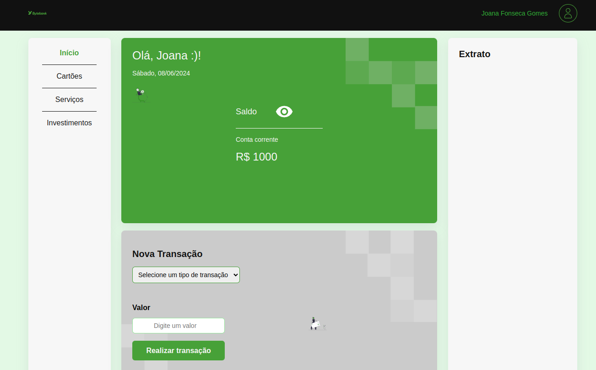

# ByteBank React JS

Essa é uma aplicação web de um site ficticio.

## Interface

  

## Sumário

- [Tecnologias Utilizadas](#tecnologias-utilizadas)
- [Status](#status)
- [Funcionalidades](#funcionalidades)
- [Explicação](#explicação)
- [Como Usar](#como-usar)
- [Autor](#autor)

## Tecnologias Utilizadas

  

    
  

  

    
  

## Status

## Funcionalidades

Esta aplicação apresenta recursos como sacar e depositar valores, consultar saldos e consultar câmbio.

## Explicação

É utilizado React para renderizar os componentes dessa aplicação, além de realizar consultas em API de cambio com o mesmo.

## Como Usar

1. git clone "caminhoDoRepositorio
2. npm init
3. utilize create react app ou vite para iniciar a servidor

## Autor

Desenvolvido por Diego Franco
